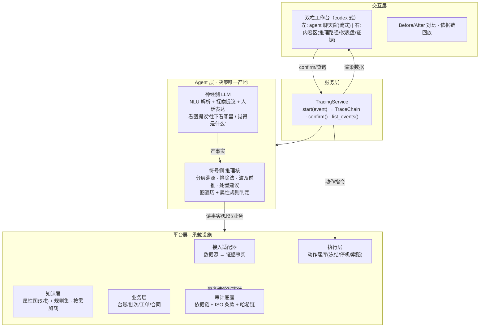
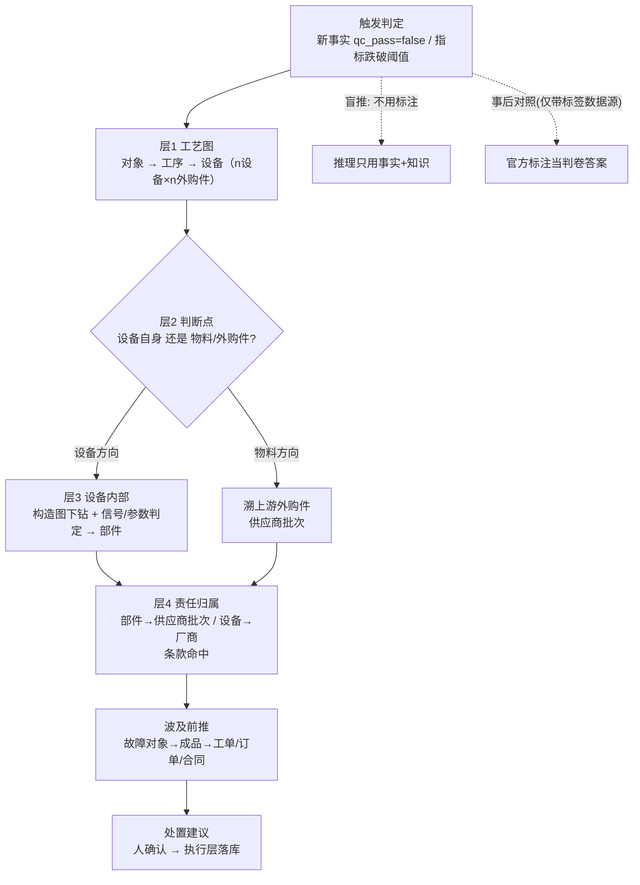
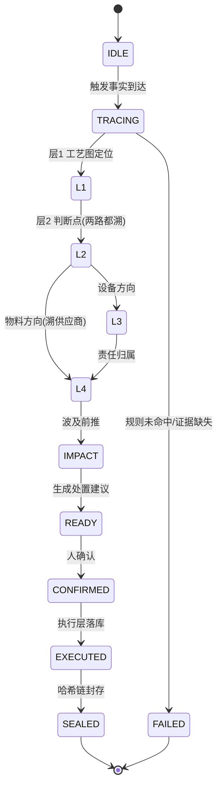
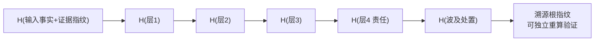

# ARD：通用分层溯源 Agent 与平台架构（一楼）

> 项目：GOAI 世界人工智能开源大赛 · 无界应用 · AI+工业制造
> 文档类型：一楼架构设计（通用 Agent + 平台，与行业/数据无关）
> 关联：docs/prd/goai-quality-agent-prd.md（PRD）、docs/ard/goai-quality-agent-ard.md（故事+demo 总架构）、二楼 demo 设计（另文档，待建）
> 状态：**待审核**（§9 决策 D1–D4 待拍板）

## 1. 定位与边界

一楼 = **不绑定任何行业、任何数据源的通用分层溯源 Agent + 承载平台**。任何工厂部署这套系统：出质量事故，沿工艺链逐层下钻（产品 → 工艺图 → 设备判断点 → 设备内部 → 责任方），每个结论带依据链、白箱可审计、哈希链防抵赖。

- **一楼包含**：决策核心（Agent 层）+ 承载设施（平台层）+ 接口契约。一楼**可用模拟事实独立开发、独立验证**，不依赖任何真实数据。
- **一楼不包含**：任何具体工厂实例（气动缸/半导体/汽车…）、任何真实数据源适配器、任何具体设备知识。这些是二楼，在契约约束下实例化。
- **一楼与二楼关系**：**契约先行**。一楼定义契约，二楼在契约内填充。二楼改自身实现随便改；改契约只允许"泛化"，禁止"为具体业务加字段"（§6 红线）。

## 2. 设计原则

| # | 原则 | 内容 |
|---|------|------|
| P1 | 神经-符号边界 | LLM/VLM 三职责：NLU（解析非结构化输入）、**探索提议**（看图提议下钻方向/候选）、**人话表达**（把推理步骤说成人话）。**决策结论由符号侧推理核把关后才成立**——LLM 提议未经推理核验证不得进入结论。 |
| P2 | 契约先行 | 接口契约是 Agent 与平台、一楼与二楼之间的唯一边界。实现只依赖契约数据结构，不认识彼此。 |
| P3 | 审计横切 | 每条结论 = **路径 + 判定 + 依据** 三件套，推理核产生结论时同步写依据与哈希。审计是结论的组成部分，不是事后打包。 |
| P4 | 白箱可回放 | 每条结论由"沿图遍历的路径 + 读属性规则的判定"构成，可逐边逐判定回放。 |
| P5 | 按需加载 | 知识层懒加载：只对**命中判断点的对象**加载完整本体，其余先用结构骨架。 |
| P6 | 决策可核验 | 系统盲推（不使用任何"标准答案"标注作为推理输入）；若数据源带有标签，标签仅作事后对照验证（二楼机制）。 |
| P7 | 换件制 | 引擎（Agent）不动，换工厂 = 换适配器 + 换知识 + 换业务数据。 |

## 3. 总体架构：Agent + 平台

平台是容器，Agent 是容器内做决策的部分。平台为 Agent 提供输入（证据事实、知识、业务数据），Agent 输出决策结论，平台负责呈现、执行、审计。



**依赖方向**：`Agent → 平台`（消费平台接口）；`平台各设施互相解耦`；`服务层`是唯一对外入口；`交互层`不直接触碰平台内部。依赖高层 → 低层、不反向、不循环。

## 4. Agent 层（决策核心）

### 4.1 神经侧（NLU，可选接入）

- 职责三件：
  ① **NLU**：把非结构化输入（质检报告文本/缺陷图片/原始信号）解析为结构化事实（EvidenceEvent）；
  ② **探索提议（proposes）**：看图提议下钻方向与候选（"往下看看 X""觉得是 Y"）——提议是假设，不是结论；
  ③ **人话表达（explains）**：把推理步骤流式说成人话（左栏聊天窗）。
- 边界：一切提议必须经推理核把关验证后才能进入 TraceChain；LLM **不得直接产出决策结论**。聊天窗输出必须引用推理核已产出的 TraceStep，不得编造。
- 选型：P0 可先不接（D4 待定）；接时作为适配器的能力之一，不改变架构。

### 4.2 符号侧：分层溯源推理核

一次事故的推理链（7 步，固定模板）：



**裁判职责**：推理核同时是裁判——LLM 提议的候选（"觉得是 Y"）必须沿图验证 + 属性判定通过才写入结论，不通过则驳回、换候选。"AI proposes, Logic disposes" 落在这条线。

**决策三件套**（推理核每次产出的最小单位）：

```python
TraceStep = {
  "layer":    "L2_gate",            # 推理层标识
  "path":     [EdgeRef, ...],        # 沿图遍历的边轨迹（可回放）
  "verdict":  {"rule": "vib_limit",  # 命中的规则
               "observed": 4.8, "threshold": 2.8, "pass": False},
  "evidence_refs": ["raw://...", ...], # 绑定的原始证据引用
  "standard_clause": "ISO 10816-3",   # 标准条款（可空）
}
```

- **路径**：可回放 → 白箱
- **判定**：读节点属性 + 规则命中 → 确定性
- **依据**：绑定原始证据 + 标准条款 → 可审计

### 4.3 一次事故的生命周期（状态机）



**状态约束**：
- `L2 → L3` 或 `L2 → L4` 的走向由判定决定，**两路都溯源**（排除法，见 PRD 图）。
- 任意层规则未命中（无候选/证据缺失）→ 进入 `FAILED`，**不硬出结论**，标注缺失，退回上层换判断点。
- 人确认是 `READY → EXECUTED` 的必要条件——系统建议，人拍板。

## 5. 平台层（承载设施）

| 设施 | 职责 | 关键约束 |
|---|---|---|
| 接入适配器 | 任意数据源 → 标准事实（EvidenceEvent）；非结构化走神经侧 | 唯一认识数据源的组件；换工厂的第一换点 |
| 知识层 | 属性图（有向图，节点带属性）+ 判定规则集；按需加载 | 不接数据源、不写业务数据；推理 = 图遍历 + 属性判定，**非 RDF/OWL 语义网** |
| 知识入库 | 知识文件（手册/规格/条款）→ 切块 → **LLM 辅助抽取**实体关系 → 人审 → 入 Ladybug | 入的是属性图，非向量库；离线建设工具，不参与运行时推理 |
| 业务层 | 台账/批次/工单/合同的事实与状态 | 不做推理；接工厂真实业务系统或沙盘 |
| 审计底座 | 依据链（证据引用+标准条款）+ 哈希链 | 横切只读，不改变推理结果 |
| 执行层 | 人确认后的动作落库（冻结/停机/索赔…）+ 出单 | 不自主决策 |
| 服务层 | 对外 API：start/confirm/list；聚合 TraceChain | 唯一对外入口 |
| 交互层 | 双栏工作台（codex 式）：左 agent 聊天窗（事故报告进、推理过程流式输出、确认交互）；右内容区（推理路径可视化逐层点亮/下钻 + 仪表盘[事故进度/待处理项] + 证据面板 + 责任处置看板） | 不直接触碰平台内部；聊天窗流式输出 = 推理步骤 + LLM 人话解释，决策结论仍出自推理核 |

### 5.1 知识层：5 域属性图

| 域 | 内容 | 边类型示例 |
|---|---|---|
| 工艺图 | 产品→工序→设备→外购件 | `partOf` / `processAt` / `usesMaterial` |
| 对象构造 | 设备/产品→系统→部件（只对命中对象建完整本体） | `partOf` |
| 故障因果 | 部件症状→故障→产品缺陷 | `hasSymptom` / `causes` / `affects` |
| 供应链 | 外购件→供应商→批次 | `suppliedBy` / `batchOf` |
| 条款 | 对象/供应商→质保/违约条款 | `subjectTo` |

**按需加载**：层1 定位到对象后，仅当进入"对象方向"判定时才加载其完整构造本体；其余对象保留结构骨架。推理引擎不知道具体加载策略，只向知识层发 `load_scope(scope)` 请求（接口见 §6）。

### 5.2 审计底座：依据链 + 哈希链



- 输入指纹：适配器对原始数据计算 SHA-256，保证"结论绑定的证据"未被篡改。
- 链式哈希：每层结论哈希与上层链接，任一环节（输入或任一结论）被改即整链失效。

## 6. 接口契约（一楼边界，二楼必须遵守）

契约是 Agent 与平台、一楼与二楼的唯一边界。二楼实现**只能**通过契约交互。

### 6.1 核心数据结构

```python
# 触发事实（适配器 → Agent）
@dataclass
class EvidenceEvent:
    entity_ref: str            # 出问题的对象引用（零件/批次/产品 ID）
    entity_type: str           # 对象类型，如 "part" | "batch" | "product"
    ts: float                  # 发生时间
    failed_indicators: list[str]   # 不合格指标名（业务词，类型通用）
    raw_ref: str               # 原始证据引用（哈希链锚点）

# LLM 提议（假设，非结论）—— loop 中"AI proposes"的载体，推理核把关后才有资格成为结论
@dataclass
class Proposal:
    id: str                    # 提议 ID（trace 用）
    layer: str                 # 所属推理层："L1"|"L2"|"L3"|"L4"
    candidate: NodeRef         # 提议目标（设备/部件/供应商 图节点）
    hypothesis: str            # 假设描述（人话，进聊天窗流式）
    basis: list[EdgeRef]       # LLM 看图的依据轨迹（防编理由，可审计）
    status: str                # "pending" | "verified" | "rejected"
    verdict: Verdict | None    # 推理核把关结果（验证后填充）

# 生命周期：LLM 产出 Proposal(pending) → 推理核沿图验证 + 属性判定
#   → verified：由 Proposal 生成 TraceStep 进 TraceChain
#   → rejected：LLM 换候选（每层候选上限 N，耗尽 → FAILED）

# 单层结论 = 路径 + 判定 + 依据（Agent → 审计 / 服务层）
@dataclass
class TraceStep:
    layer: str                 # "L1" | "L2" | "L3" | "L4" | "impact"
    path: list[EdgeRef]
    verdict: Verdict           # rule_id + observed + threshold + pass
    evidence_refs: list[str]
    standard_clause: str | None

# 一次事故完整链（服务层 → 交互层）
@dataclass
class TraceChain:
    trigger: EvidenceEvent
    steps: list[TraceStep]
    impact: dict               # 波及面摘要（成品/工单/订单/合同）
    actions: list[Action]      # 处置建议
    root_hash: str
```

### 6.2 平台接口

```python
class GraphStore:          # 知识层
    def query(self, start: NodeRef, rel: str, direction: str) -> list[EdgeRef]
    def get_node(self, ref: NodeRef) -> Node
    def load_scope(self, scope: str) -> None     # 按需加载

class BusinessStore:       # 业务层
    def query(self, filters: dict) -> list[Record]   # 台账/批次/合同
    def apply(self, actions: list[Action]) -> list[ActionResult]

class Audit:               # 审计底座
    def append(self, step: TraceStep) -> str     # 返回该步哈希
    def verify(self, root_hash: str) -> bool     # 独立重算校验

class TracingService:      # 服务层（对外入口）
    def start(self, event: EvidenceEvent) -> TraceChain
    def list_events(self) -> list[EvidenceEvent]
    def confirm(self, chain_id: str, actions: list[str]) -> ExecutionReport
```

### 6.3 契约修改红线

- **允许**：泛化修改——发现契约缺一类能力（如新增一种证据类型），抽象得更通用。
- **禁止**：业务特化——在契约里塞具体业务字段/逻辑（如 `cylinder_bottom`、`DMC-50H`、`SKF 6205`）。
- 判定标准：**把契约读给另一行业的工程师听，如果他不需要理解任何具体工厂，就能懂，则契约是通用的。** 二楼如发现契约逼着自己特化，必须先改一楼（泛化），再在二楼填充。

## 7. 换件清单（不变点 / 可变点）

| 不变点（引擎不动） | 可变点（换工厂时替换） |
|---|---|
| Agent 推理核（7 步链 + 排除法 + 波及前推） | 接入适配器（新数据源 → 证据事实） |
| 接口契约（§6） | 知识层内容（工艺图/构造/故障因果/供应链/条款重灌） |
| 审计底座（依据链 + 哈希链） | 业务层数据（台账/批次/工单/合同） |
| 双栏交互形态（codex 式） | 特定行业判定规则（属知识层） |

## 8. 质量属性与边界条件

| 属性 | 设计 |
|---|---|
| 可测试性 | 一楼用**模拟事实驱动**：构造 EvidenceEvent + 模拟图/业务数据，验证 7 步链可走通、哈希链可重算、异常路径有兜底。不依赖真实数据即可开发。 |
| 空值/缺失 | 指标缺失 → 不触发；证据加载失败 → 该对象降级为"无证据"，标注缺失，不硬判；规则未命中 → 进 FAILED，退回上层换判断点 |
| 性能 | 图规模万级三元组；按需加载避免全量；事实表查询避免 N+1 |
| 正确性 | 决策全部来自确定性推理；LLM 无决策权；每条结论可逐边逐判定回放 |
| 安全/隔离 | 沙盘与真实数据以来源标记区分；密钥只从环境变量读；审计链防篡改 |

## 9. 技术选型（已定稿）

| # | 选型 | 定稿 | 备注 |
|---|---|---|---|
| D1 | 属性图存储 | **Ladybug**（原 Kuzu，嵌入式属性图 + Cypher，`pip install ladybug`） | 真"图数据库"名分 + 轻量（8GB 环境跑得动）+ MIT 开源（贴合大赛）；比自写强、比 Neo4j 轻 |
| D2 | 推理核形态 | **自研推理核**：Ladybug 做图查询（Cypher 遍历），推理逻辑自研（含 TBox 类推理） | 7 步链固定，框架是负担；Ladybug 实现不了的本体/描述逻辑推理自研兜底 |
| D3 | 交互层前端 | **React + Vite** + React Flow（推理路径可视化） | 双栏 codex 式 + 流式聊天窗 + 交互式节点图 |
| D4 | 神经侧 LLM | **LLM 提议 + 推理核把关**（AI proposes, Logic disposes） | LLM 看图提议下钻方向/候选 + 人话表达；推理核验证通过才成结论 |
| D5 | Web 后端 | **FastAPI** | 异步 + SSE 流式（聊天窗流式输出） |
| D6 | 知识入库抽取 | **LLM 辅助抽取**（文件 → LLM 抽实体关系 → 人审 → 入 Ladybug） | 换行业重灌知识也通用 |
| D7 | 沙盘存储 | SQLite | 轻量、单机、够演示 |

> 风险备注：Ladybug 为 Kuzu 更名后的新项目。已知硬编码问题：darwin-arm64 预编译 `lbugjs.node` 硬编码 Homebrew OpenSSL 路径，无 Homebrew 的 Mac 上 dlopen 失败（Issue #681，已被 PR #682 修复）——spike 阶段验证 Python 绑定在当前 Mac 正常加载。开发以最小依赖使用（基础 Cypher 查询），不依赖其高级特性，复杂推理自研兜底。

## 10. 开发与验证策略

0. **选型 spike**：Ladybug 先最小验证（建图 + Cypher 遍历 + 事务），确认基础能力可靠再铺开；高级特性不依赖。
1. **先一楼后二楼**：一楼（Agent + 平台 + 契约）用模拟事实独立开发调通。
2. **契约先行**：二楼开工前，一楼契约定稿；二楼数据映射在契约约束下设计。
3. **泛化优先**：一楼跑通后，二楼真实数据验证契约；契约不够用 → 泛化一楼 → 二楼重填。禁止为二楼加业务字段。
4. **模拟事实测试集**：覆盖正常路径（7 步全走通）、异常路径（规则未命中、证据缺失、空事实）、审计验证（篡改即失效）。
