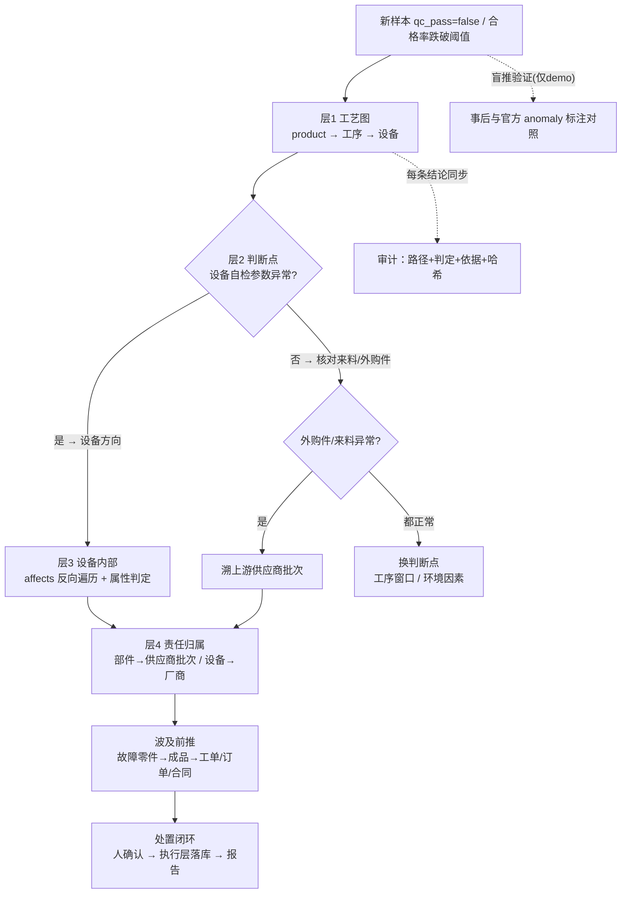
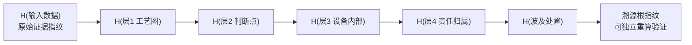
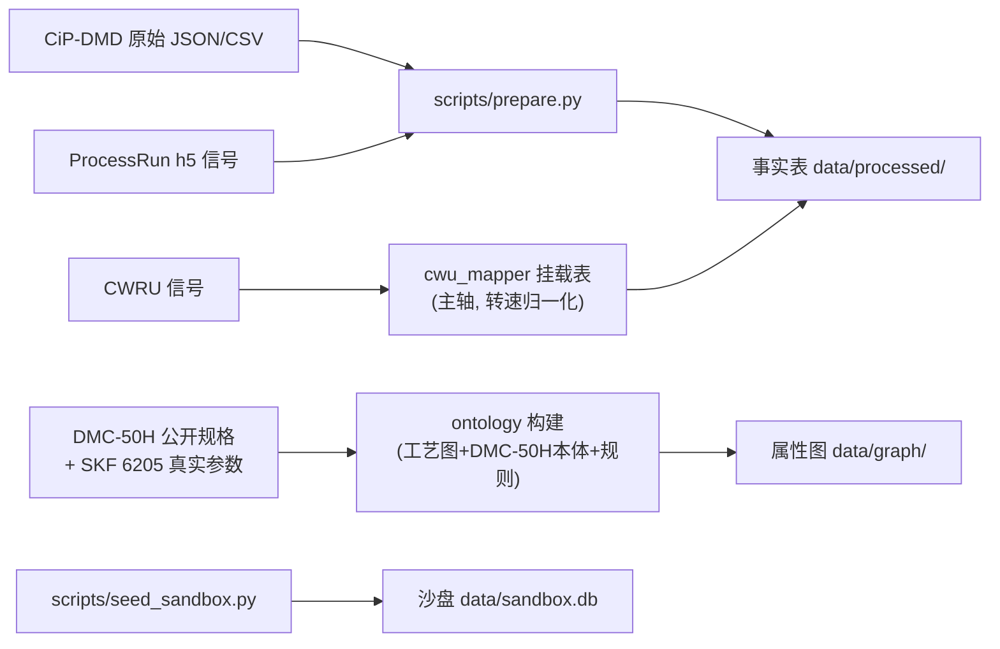
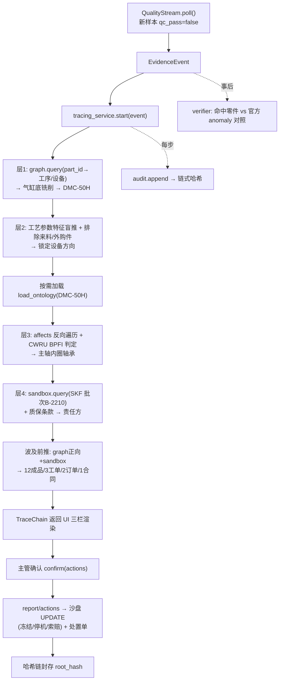

# ARD：工业质量事故跨层溯源与责任定位 Agent

> 项目：GOAI 世界人工智能开源大赛 · 无界应用 · AI+工业制造
> 文档类型：架构设计文档（Architecture Design Document）
> 关联：docs/prd/goai-quality-agent-prd.md（产品需求）、docs/idea_v2.md（Idea v2 概念基线）
> 状态：**待审核**（§5 架构决策 D1–D4 待拍板，其余章节为设计定稿方向）

## 1. 文档定位

PRD 回答了"做什么"，本文档回答"怎么实现"。PRD 已确立两个层次，本架构同样分两层：

- **故事架构（§3）**：任何一家工厂都能用的**通用方法**——分层溯源推理引擎。不绑定行业、不绑定数据源。
- **demo 架构（§4）**：把通用方法落到**气动缸实例**（TU Darmstadt CiP-DMD + CWRU）的实例化设计与数据映射定稿。

核心原则：**换工厂 = 换接入适配器 + 换知识库 + 换业务沙盘，推理引擎不动。**

## 2. 架构设计原则（硬约束）

| # | 原则 | 内容 |
|---|------|------|
| P1 | 神经-符号边界 | LLM/VLM 三职责：NLU（解析非结构化输入为结构化事实）、**探索提议**（看图提议下钻方向/候选）、**人话表达**（把推理步骤说成人话）。**决策结论唯一产地是确定性推理引擎**——LLM 提议未经推理核验证不得进入结论。 |
| P2 | 通用核心与实例解耦 | 推理引擎只消费"证据事实"这一标准接口；接入适配器是唯一认识具体数据源的组件。换工厂 = 换适配器/知识库/沙盘，引擎不改一行。 |
| P3 | 审计横切 | 推理引擎每产生一条结论，同步写"路径 + 判定 + 原始依据 + 哈希"。审计不是事后打包，是结论的组成部分。 |
| P4 | 白箱可回放 | 每条结论由"沿图遍历的路径 + 读属性规则的判定"构成，可逐边逐判定回放。 |
| P5 | 按需加载 | 知识层懒加载：只对**命中判断点的设备**建完整本体，其余设备先用结构骨架。 |
| P6 | 决策可核验 | demo 中系统盲推（不用官方标注），事后与官方 `anomaly` 标注对照验证。标签是判卷答案，不是推理输入。 |
| P7 | 不锁定选型 | 属性图承载、图遍历+规则判定推理、哈希链审计为架构承诺；图数据库/框架选型留待 §5 决策，不在此锁定。 |

## 3. 故事架构（通用方法）

### 3.1 部署总览

```
                        ┌────────────────────────────────────────────┐
                        │  用户：质量工程师 · 生产主管 · 合规审计      │
                        └──────────────────┬─────────────────────────┘
                                           │ ① 查看 · ② 确认执行
┌──────────────────────────────────────────▼─────────────────────────┐
│  交互层 (UI)                                                        │
│  三栏工作台：溯源图(逐层点亮/下钻) │ 原始证据面板 │ 责任处置看板      │
│  + Before/After 对比              + 依据链可回放                    │
└──────┬─────────────────────────────────────────────────────────────┘
       │ 查询 / 动作指令
┌──────▼─────────────────────────────────────────────────────────────┐
│  推理引擎 (Inference Engine)          ◀── 符号侧 · 决策唯一产地      │
│  ① 触发判定  ② 层1工艺图  ③ 层2判断点(排除法)                        │
│  ④ 层3设备内部 ⑤ 层4责任归属 ⑥ 波及前推 ⑦ 处置建议                    │
│  每步 = 沿图遍历 + 读属性规则判定                                     │
└──┬───────────────┬───────────────┬───────────────┬─────────────────┘
   │ 读知识         │ 读/写业务      │ 写审计        │ 执行动作
┌──▼───────────┐ ┌─▼───────────┐ ┌─▼────────────┐ ┌▼──────────────┐
│ 知识层        │ │ 业务层       │ │ 审计底座      │ │ 执行层         │
│ 属性图(5域)   │ │ 工厂真实业务 │ │ 依据链(每条  │ │ 冻结批次/停机/ │
│ 工艺图/设备/ │ │ 台账·批次·   │ │ 结论绑定原始 │ │ 索赔…写入业务层│
│ 部件判定/合同 │ │ 工单·订单    │ │ 数据+ISO条款)│ │               │
│ + 规则集      │ │              │ │ + 哈希链     │ │               │
│ (按需加载)    │ │              │ │              │ │               │
└──┬───────────┘ └──────────────┘ └──────────────┘ └───────────────┘
   ▲ 加载请求(只对命中判断点的设备建完整本体)
┌──┴────────────────────────────────────────────────────────────────┐
│  接入适配器 (Ingest Adapter)          ◀── 换工厂的第一换点           │
│  结构化数据流 → 证据事实（直接映射）                                  │
│  非结构化输入 → 神经侧（NLU 解析 + 探索提议 + 人话表达）          │
└──┬─────────────────────────────────────────────────────────────────┘
   ▲ 数据流
┌──┴────────────────────────────────────────────────────────────────┐
│  产线数据流（任意工厂）：质检流 · 工艺流 · 设备信号流                │
└────────────────────────────────────────────────────────────────────┘
```

### 3.2 组件职责与边界（防膨胀的硬约束）

| 组件 | 负责 | **明确不负责** |
|---|---|---|
| 接入适配器 | 产线数据 → 结构化"证据事实"；非结构化走神经侧 NLU | 不推理、不判责、不写业务数据 |
| 神经侧 LLM/VLM | NLU 解析非结构化输入 + 探索提议（看图提议下钻方向/候选）+ 人话表达 | **不直接输出决策结论**（提议须经推理核把关） |
| 推理引擎 | 分层溯源决策（图遍历 + 规则判定），输出路径/判定/依据 | 不解析原始文本、不渲染 UI |
| 知识层 | 5 域属性图 + 判定规则，按需加载 | 不接数据源、不写业务数据 |
| 业务层 | 台账/批次/工单/合同的事实与状态 | 不做溯源推理 |
| 审计底座 | 依据链 + ISO 条款映射 + 哈希链（横切，只读不改推理） | 不改变推理结果，只记录 |
| 执行层 | 人确认后的动作落库（冻结/停机/索赔） | 不自主决策 |

### 3.3 核心数据流：一次事故 = 一次推理链



**每一条结论的最小单位 = 路径 + 判定 + 依据 三件套：**
- **路径**：沿属性图的边遍历轨迹（可回放）
- **判定**：读节点属性的规则命中（如 `振动 4.8 > 限值 2.8 mm/s` 成立）
- **依据**：绑定的原始证据 + 标准条款（ISO 9001 / ISO 10816）

三件套是白箱可审计与哈希链绑定的对象。

### 3.4 知识层：5 域属性图

属性图（有向图，节点=对象带属性，边=有向关系）承载全部领域知识。不采用 RDF/OWL 语义网，不做描述逻辑推理；**推理 = 沿边遍历 + 读属性判定**。

| 域 | 内容 | 边类型示例 |
|---|---|---|
| 工艺图 | 产品→工序→设备→外购件 | `partOf` / `processAt` / `usesMaterial` |
| 设备构造 | 设备→系统→部件（只对命中设备建完整本体） | `partOf` |
| 故障因果 | 部件症状→故障→产品缺陷 | `hasSymptom` / `causes` / `affects` |
| 供应链 | 外购件→供应商→批次 | `suppliedBy` / `batchOf` |
| 合同条款 | 设备/供应商→质保/违约金条款 | `subjectTo` |

**按需加载**：知识层接收推理引擎的加载请求。层1 定位到设备后，仅当该设备进入层2 判断点且判定"设备方向"时，才加载其完整构造本体；其余设备只保留工艺图层的结构骨架。避免为全厂所有设备建完整本体（工作量与内存双控）。

### 3.5 审计底座：依据链 + 哈希链



- 输入指纹：接入适配器对原始数据（信号/记录）计算 SHA-256，保证"结论绑定的证据"未被事后篡改。
- 链式哈希：每层结论哈希与上层链接，任一环节（输入或任一结论）被改动即整链失效。
- demo 以哈希链模拟上链存证，不真部署区块链网络。

### 3.6 换工厂清单（通用方法的不变点与可变点）

| 不变点（引擎不动） | 可变点（换工厂时替换） |
|---|---|
| 推理引擎（分层溯源 + 排除法 + 波及前推） | 接入适配器（新数据源→证据事实） |
| 审计底座（依据链 + 哈希链） | 知识层内容（工艺图/设备/供应链/合同重灌） |
| 三栏交互形态 | 业务层数据（台账/批次/工单/合同） |
| 7 步推理链模板 | 知识库中特定行业判定规则 |

## 4. demo 架构（气动缸实例）

### 4.1 实例化映射

| 故事组件 | demo 实例 | 真/盘 |
|---|---|---|
| 产线数据流 | CiP-DMD（质检 CSV / meta JSON / ProcessRun h5）+ CWRU 轴承信号 | 真（CWRU 挂载为主轴证据） |
| 接入适配器 | cip-dmd-loader：JSON/CSV→证据事实；h5→工艺参数特征/振动特征 | 真 |
| 神经侧 NLU | （P0 不接，见 §5 D4；接则解析质检报告/图片） | 可选 |
| 知识层 | 属性图：工艺图（锯/车/铣/装配）+ DMC-50H 完整本体 + 判定规则（ISO 10816 / 轴承特征频率公式） | 知识来源：公开规格 + 通用结构常识 + 真实部件参数（SKF 6205） |
| 推理引擎 | 故事架构引擎原样使用 | 不动 |
| 业务层 | SQLite 沙盘：3 台真实机床 + 装配站 + 同型号扩量台账、供应商、工单、客户合同 | 盘（明确标注） |
| 审计底座 | 哈希链：h5/字段指纹 + 每层链式哈希 | 真 |
| 执行层 | UPDATE 沙盘（冻结批次 / 停机换轴承 / 发起索赔）+ 出具处置单 | 盘 |

### 4.2 数据映射定稿（接入适配器的核心交付）

| 推理环节 | 真实字段 | 来源文件 | 真/盘 |
|---|---|---|---|
| 触发 | `qc_pass=false` 的气缸底（装配后压力 / 铣削 surface_roughness 超差） | quality_data.csv / meta_data.json | 真 |
| 层1 工艺图 | `part_type` + `process_data[].name` → 气缸底 → 铣削工序 → DMC-50H | meta_data.json | 真 |
| 层2 判断点（盲推） | ProcessRun 工艺参数特征（时域统计量/参数漂移） | `internal_machine_signals.h5` | 真 |
| 层3 设备内部 | CWRU 包络谱 → BPFI 内圈故障特征频率（转速归一化比例 x=f/转速 判定，不绑定绝对转速） | CWRU 信号 → 挂 DMC-50H 主轴 | 真（挂） |
| 盲推验证 | 官方 `anomaly` 标注（**仅事后对照，不入推理**） | meta_data.json `process_data[].anomaly` | 真（判卷） |
| 波及前推 | `component_ids` 装配关系：故障气缸底 → 成品气缸 → 工单/订单 | meta_data.json | 真 |
| 层4 责任归属 | 主轴轴承 → SKF 供应商批次 #B-2210；质保条款命中 | SQLite 沙盘 | 盘 |
| 业务数字 | 设备台账扩量、工单/订单/合同违约金额 | SQLite 沙盘 | 盘 |

**demo 选样（已定）**：事故剧本 = 气缸底批次 **R-17**（铣削粗糙度不合格），波及 12 台成品 / 3 张工单 / 2 个订单 / 1 个客户合同。

### 4.3 demo 运行形态

```
数据准备(prepare.py)                    运行时
CiP-DMD 原始 JSON/CSV/h5 ──▶ 标准事实表 + 属性图(按需加载) ──▶ 推理引擎 ──▶ 三栏 UI
       + SQLite 沙盘种子                                   ▲           │
                                                           盲推对照(事后)  └──▶ 哈希链校验
```

- **一次事故 = 一次演示**：从质检流扫描第一个 `qc_pass=false` 触发，≤3 分钟走完 7 步。
- 数据准备为离线一次性：把原始 JSON/CSV 清洗为标准事实表，h5 按需抽取特征，属性图按 §5 D1 选型承载。
- 演示环境低配（约 8GB 内存）：数据准备离线、运行时轻量、UI 单进程（见 §5 D3）。

### 4.4 demo 的"真/盘"边界（必须标注，不得虚构）

| 位置 | 边界 |
|---|---|
| 真实 | CiP-DMD 工艺/质检/装配字段、ProcessRun 工艺参数、CWRU 振动信号、DMC-50H 公开规格 + SKF 6205 真实参数 |
| 沙盘（标注"盘"） | 设备台账扩量（真实 3 台 + 同型号扩到十几台）、供应商批次、工单/订单/合同、违约金额 |
| 口径提醒 | 维修手册为受控文档不公开，设备知识用公开规格 + 通用结构常识 + 真实部件参数搭建——demo 演示推理机制，不演示知识完备性 |

### 4.5 模块架构（含接口契约）

模块与故事架构组件一一对应，依赖方向**高层 → 低层、不反向不循环**；`engine` 不认识 `adapter`，只消费契约数据结构。

```
┌──────────────────────────────────────────────┐
│  ui/app.py  三栏工作台                         │
│  订阅 TraceChain 渲染 · 动作确认按钮           │
└───────────────▲──────────────────────────────┘
                │ I8: TraceChain 渲染  /  I9: confirm(actions)
┌───────────────┴──────────────────────────────┐
│  api/tracing_service.py  服务层                │
│  start(event)→TraceChain · list_events()      │
│  confirm(chain_id, actions)→Report            │
└──────┬──────────────┬──────────────┬──────────┘
       │ I1 触发事件    │ I6 动作       │ I7 审计
┌──────▼───────┐ ┌─────▼─────────┐ ┌─▼─────────────┐
│ adapter/      │ │ report/       │ │ audit/         │
│ cipdmd_loader │ │ actions.py    │ │ evidence.py    │
│ h5_extractor  │ │ pdf_report.py │ │ chain.py       │
│ cwu_mapper    │ └───────────────┘ └──────▲───────┘
└──────┬───────┘                           │
       │ I2 证据事实                        │ 每步 append(TraceStep)
┌──────▼────────────────────────────────────┴───────┐
│ engine/  tracer.py · rules.py · verifier.py        │
│ 分层溯源编排(7步) · 属性判定 · 盲推对照             │
└──────┬─────────────────────────────┬───────────────┘
       │ I3 图遍历(读)              │ I5 沙盘查询/写
┌──────▼──────────────┐  ┌──────────▼──────────────┐
│ graph/               │  │ sandbox/                │
│ graph_store.py       │  │ db.py · seed.py         │
│ ontology/            │  │ (SQLite)                │
│ 工艺图/DMC-50H/规则   │  └─────────────────────────┘
└──────────────────────┘
```

**接口契约**（模块间边界，见下方数据结构定义）：

| 接口 | 方向 | 签名 / 数据 |
|---|---|---|
| I1 | adapter → api | `EvidenceEvent{part_id, part_type, ts, failed_features, raw_ref}` |
| I2 | api → engine | `start(event) → TraceChain` |
| I3 | engine → graph | `query_edges(start, rel, dir) / get_node(id)`（只读遍历） |
| I4 | engine → graph | `load_ontology(scope)`（按需加载完整本体） |
| I5 | engine → sandbox | `query_po_batch() / query_contract() / apply_actions()` |
| I6 | api → report | `ConfirmedActions → 沙盘 UPDATE + 处置单` |
| I7 | engine → audit | `append(TraceStep) → 链式哈希` |
| I8 | api → ui | `TraceChain{steps[], evidence, report, root_hash}` |
| I9 | ui → api | `confirm(chain_id, actions[])` |

**接口数据结构**（`api/models.py`，模块间契约，不随实现漂移）：

```python
@dataclass
class EvidenceEvent:          # 触发事实（I1）
    part_id: str
    part_type: str            # "cylinder_bottom" | "piston_rod" | "cylinder"
    ts: float
    failed_features: list[str]   # e.g. ["surface_roughness"]
    raw_ref: str              # 原始数据引用（审计依据）

@dataclass
class TraceStep:              # 单层结论（I7，三件套：路径+判定+依据）
    layer: str                # "L1_process" | "L2_gate" | "L3_internal" | ...
    path: list[EdgeRef]       # 沿图遍历的边轨迹（可回放）
    verdict: dict             # 属性判定（规则名 + 命中值，如 4.8 > 2.8）
    evidence_refs: list[str]
    iso_clause: str | None

@dataclass
class TraceChain:             # 一次事故完整链（I8）
    trigger: EvidenceEvent
    steps: list[TraceStep]
    impact: dict              # 波及面：成品/工单/订单/合同
    root_hash: str
```

### 4.6 数据流

**准备期（离线一次性）**：



**运行期（一次事故）**：



数据形态流转：`质检 CSV 行 → EvidenceEvent → TraceStep[] → TraceChain → 前端渲染模型`。

### 4.7 文件架构

```
goai-quality-agent/                 # 仓库根
├── docs/                           # PRD / ARD / idea（本目录）
├── data/                           # 数据产物（git 排除）
│   ├── raw/                        # 原始 CiP-DMD/CWRU（外部获取，不入库）
│   ├── processed/                  # 事实表 + 属性图序列化 + 挂载表
│   └── sandbox.db                  # SQLite 沙盘
├── src/
│   ├── adapter/
│   │   ├── cipdmd_loader.py        # JSON/CSV → EvidenceEvent
│   │   ├── h5_extractor.py         # h5 → 工艺参数特征 / 振动特征
│   │   └── cwu_mapper.py           # CWRU 挂 DMC-50H 主轴（转速归一化）
│   ├── graph/
│   │   ├── graph_store.py          # 属性图存储与查询接口（I3/I4）
│   │   └── ontology/
│   │       ├── process_graph.py    # 工艺图（产品→工序→设备→外购件）
│   │       ├── dmc50h_ontology.py  # DMC-50H 完整本体（结构+影响）
│   │       └── rules.py            # 判定规则集（ISO 10816 / 特征频率）
│   ├── engine/
│   │   ├── tracer.py               # 分层溯源编排（7 步）
│   │   ├── rules.py                # 属性判定执行器
│   │   └── verifier.py             # 盲推对照验证（demo 特有）
│   ├── sandbox/
│   │   ├── db.py                   # 沙盘 schema + CRUD
│   │   └── seed.py                 # 种子数据（台账/供应商/合同）
│   ├── audit/
│   │   ├── evidence.py             # 依据链（证据引用 + ISO 条款）
│   │   └── chain.py                # 哈希链
│   ├── api/
│   │   ├── models.py               # 接口契约数据结构（§4.5）
│   │   └── tracing_service.py      # 服务层：start/confirm/list
│   ├── report/
│   │   ├── actions.py              # 处置动作执行（写沙盘）
│   │   └── pdf_report.py           # ISO 9001 报告导出
│   └── ui/
│       └── app.py                  # 三栏工作台
├── scripts/
│   ├── prepare.py                  # 离线数据准备（原始→事实表+图）
│   └── seed_sandbox.py             # 沙盘建库种子
├── tests/                          # 单测 / 集成测试（盲推验证在此跑）
└── pyproject.toml                  # 依赖与工具链配置
```

**依赖方向约束**：`engine` 只依赖 `graph`/`sandbox`/`audit` 的接口，不依赖 `adapter`/`ui`/`report`；`adapter` 不依赖任何上层。目录结构待 §5 决策（尤其 D1 图存储、D3 前端）确认后微调。

## 5. 待定架构决策（待审核拍板）

| # | 决策 | 建议 | 理由 |
|---|---|---|---|
| D1 | 属性图存储 | 内存 + 文件序列化（NetworkX 或自写邻接表），不引入图数据库 | 图规模万级三元组；Neo4j 重且演示环境不一定有；轻量、核心逻辑自写 |
| D2 | 推理引擎形态 | 自写图遍历 + 规则函数，不引规则引擎框架 | 分层溯源路径固定，框架是负担；规则是"读属性判定"，简单可回放 |
| D3 | 前端三栏工作台 | Streamlit（轻、单进程）或 React（重但表现力强） | 8GB Mac + ≤3 分钟演示，Streamlit 够用且快 |
| D4 | demo 是否接 LLM | P0 不接，纯符号侧跑通；接 LLM 作加分项后置 | 盲推验证证明"不用 LLM 也能找到问题"，反成卖点 |

## 6. 风险与边界条件

| 风险 | 边界条件与缓解 |
|---|---|
| 盲推判定规则未定稿 | 层2 用工艺参数特征盲推的具体规则（特征选样/阈值）在 demo 设计阶段定稿；盲推验证指标 = 命中零件与官方标注一致 |
| CWRU 转速口径 | CWRU 实测 1730 RPM（电机级），与真实主轴转速不同——按"特征频率转速归一化比例"判定故障类型，不绑定绝对转速 |
| 数据缺失 | piston rod 质量数据缺失 32.5%、ProcessRun 无时间戳——主线已移到气缸底铣削，活塞杆仅作工艺图正常环节；`qc_pass=null` 不视为不合格 |
| 口径不一致 | 触发用 CiP-DMD QC 限值（如 surface_roughness 0–2.5）；知识层示例"Ra 1.6 > 0.8 μm"与 QC 限值口径需在数据映射定稿时对齐，避免文档自相矛盾 |
| 空值/失败路径 | 事实表中 `qc_pass` 为空 → 不触发；h5 加载失败 → 该零件降级为"无工艺证据"，标注缺失，不做判定；规则未命中 → 进入"换判断点"分支，不硬出结论 |
| 图规模与加载 | 全厂全设备完整本体不可行 → 按需加载（§3.4）兜底；知识量级价值在跨层推理链而非单设备图 |
| 沙盘与真实数据隔离 | 沙盘字段与真实数据字段以来源标记区分；演示口径"真实核 + 沙盘扩规模"答辩必须讲清，不虚构真实信号 |

## 7. 后续

1. §5 决策拍板（审核时定）。
2. 数据映射定稿补齐：层2 盲推工艺参数特征选样、盲推验证判定规则、surface_roughness 超差批次选样核对。
3. demo 骨架实现（真实数据 → 推理 → 三栏工作台最小闭环）。
4. 答辩材料（故事架构叙事 + demo 录屏）。
