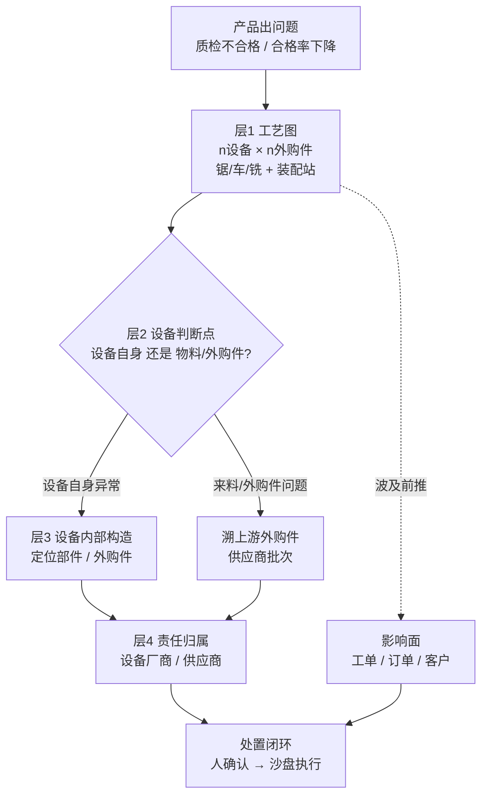
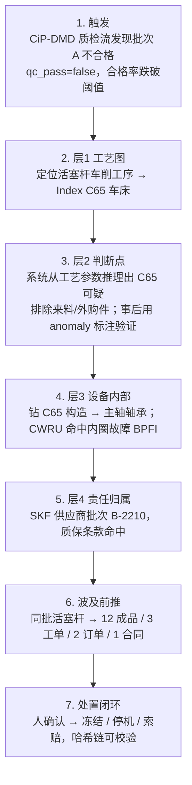
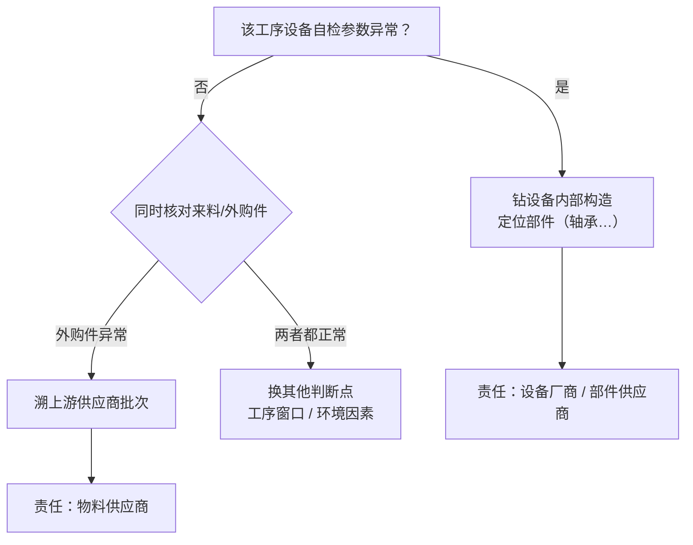
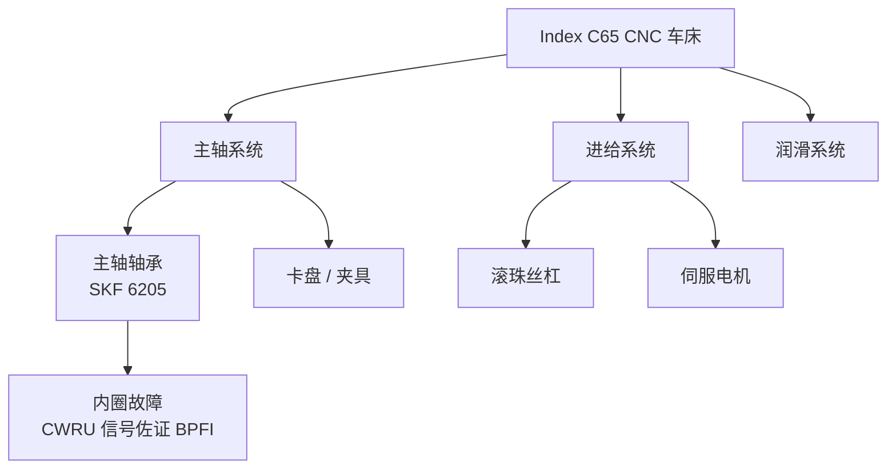
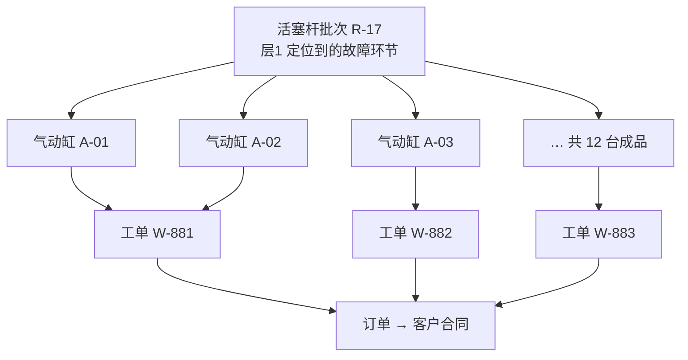
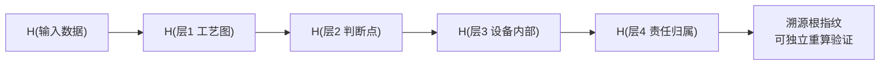
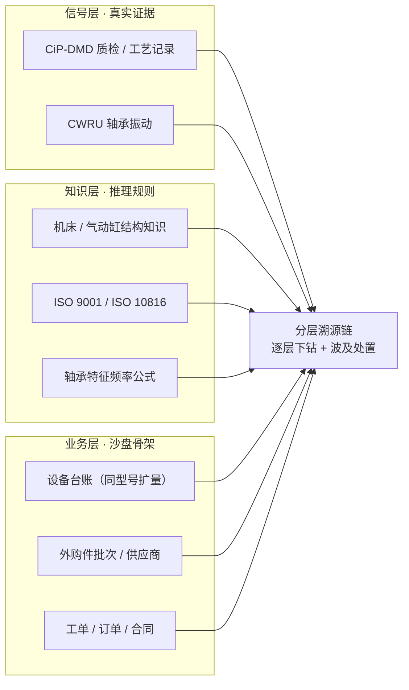
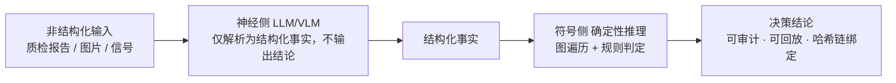
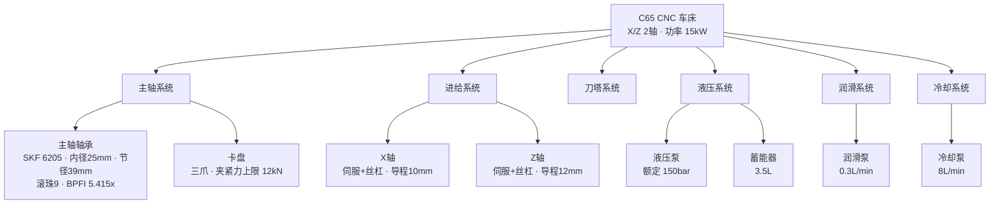
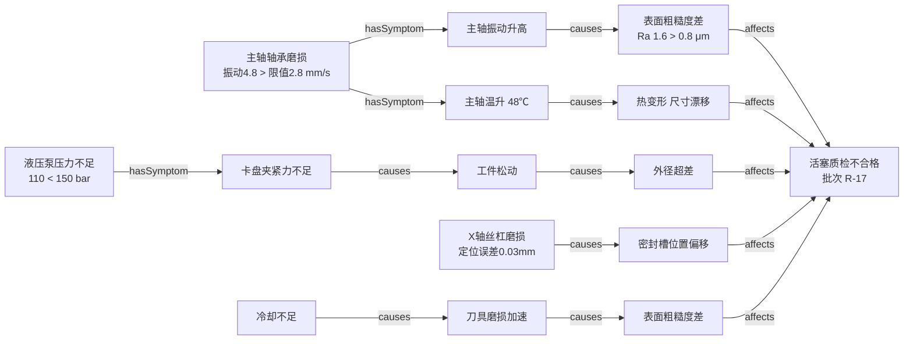

# PRD：工业质量事故跨层溯源与责任定位 Agent

> 项目：GOAI 世界人工智能开源大赛 · 无界应用 · AI+工业制造
> 文档类型：产品需求文档（Product Requirements Document）
> 关联：docs/idea_v2.md（Idea v2 概念基线）

## 1. 问题陈述

制造企业发生质量事故（如某批次气动缸质检不合格）时，追责与处置依赖人工跨系统翻查：MES 查工艺、QMS 查检验记录、ERP 查工单与合同，影响面靠人脑估算。结果是**慢**（事故响应以天计）、**漏**（同批次组件/关联订单易遗漏）、**不可审计**（结论无依据链，无法满足 ISO 9001 强制追溯与合规取证）。

更关键的是：现有追溯系统只能"事后查记录"，不能"主动推理"——它查得到**这批气动缸是谁在什么时候加工、测过哪些尺寸**，但答不出**是这台机床的哪个部件出了问题、还是来料外购件出了问题、责任该落到哪个供应商/厂商**。这是真实硬痛点，不是想象。

## 2. 目标与定位

一句话定位：**"AI 提出，逻辑审判"**——一个用确定性推理做跨层溯源、白箱可审计的工业质量事故追责 Agent。一批气动缸质检不合格，沿工艺链**逐层下钻**（产品 → 工艺图 → 设备判断点 → 部件/外购件 → 责任方），每个结论带依据链，决策正确性来自**确定性逻辑推理**而非 LLM 概率。

- **做什么**：把"缺陷 → 工艺 → 设备 → 部件/外购件 → 责任方 → 波及面"的牵一发动全身，一次性推演清楚并可视化。
- **给谁**：质量工程师（追根因）、生产主管（处置波及面）、合规审计（取证）。
- **解决什么**：追责慢、影响面算不清、结论不可审计。

> 定位取舍：作为 GOAI 演示作品交付，不期待真正被他人复用；但架构层面**领域知识与数据沙盘解耦、配置驱动**，演示时展示"换行业仅换数据"的可复用能力，覆盖评审"开放复用价值"维度。

### 一次事故的全貌（分层溯源总览）

> 每一层是一张图、逐层钻取；每个结论带依据链，白箱可审计、哈希链可校验。

### 故事 vs demo：演示叙事框架

本 PRD 区分两层：**故事**（产品完整愿景）与 **demo 现实**（因资源/数据受限做的取舍）。答辩时先讲完整故事，再明确交代 demo 在哪做了取舍、为什么——先自己交代，评审无可挑剔。

| 维度 | 故事（产品愿景） | demo 现实 | 桥接：为什么出此下策 |
|------|-----------------|-----------|---------------------|
| 发现问题 | 系统从产线数据流**主动推理**出异常，无需任何事先标注 | CiP-DMD 是给机器学习 benchmark 用的带标签集（官方 `anomaly` 标注）。demo 中系统**不用标签、纯靠推理**定位问题，跑完再与官方标注对照验证 | 标签是 benchmark 的"答案"；demo 让系统盲推、官方标注当判卷老师——证明"不用标签也能找到问题"，反而更强 |
| 设备知识来源 | 基于厂商维修手册 / 内部结构图的完整设备知识库 | 维修手册是受控文档、网上不公开。demo 用**公开规格 + 通用结构常识 + 真实部件参数**（如 SKF 6205 完整参数）搭构造本体骨架 | 拿不到厂商维修手册；demo 演示的是**推理机制**，不是知识完备性 |
| 设备台账 / 工艺图规模 | 全厂完整设备台账与工艺图 | 真实设备仅 3 台 + 装配站，沙盘同型号扩到十几台 | 开源数据规模有限；沙盘扩量，但真实信号仍挂在真实设备上 |
| 供应链 / 质保 / 合同 | 真实供应商批次、质保条款、合同违约数据 | 供应商批次、设备质保、违约条款由沙盘构造（含"C65 仍在质保期"口径） | 供应链数据不公开；demo 用真实规则 + 沙盘数据 |
| 设备建模范围 | 全厂所有设备全部建模 | 只对**命中判断点**的设备建完整本体（按需加载） | 知识建模工作量巨大；demo 展示单台完整建模能力，schema 可扩展 |

## 3. 目标用户 + 典型场景

| 用户 | 使用方式 | 频次 |
|------|---------|------|
| 质量工程师 | 事故由系统自动发现，查看溯源链与责任归属 | 偶发但高代价 |
| 生产主管 | 看波及面与处置方案，确认后执行 | 同上 |
| 合规审计 | 回放推理链取证、核对依据、校验哈希链 | 审计周期 |

**典型场景走一遍**（演示主故事线）：

1. 系统从 CiP-DMD 质检数据流发现批次 A 的气动缸不合格（装配后检漏/尺寸质检不过，`qc_pass=false`，合格率跌破阈值）→ 自动触发推理链。
2. **层1 工艺图**：沿工艺图定位到活塞杆车削工序 → **Index C65 车床**（质量×工艺知识域：该工序尺寸超差分布集中在车削轴颈）。
3. **层2 设备判断点**：系统从 CiP-DMD ProcessRun 工艺参数**推理**出 C65 车床可疑（demo 不用官方 `anomaly` 标注、纯推理）→ 判**设备自身问题**；同时排除法核对该工序来料（锯切下料的钢棒半成品批次）与装配外购件（壳体/活塞/密封圈）批次无异常 → 排除物料方向，锁定设备方向。事后与官方标注对照，验证推理正确（见 §2 故事 vs demo）。
4. **层3 设备内部**：钻 C65 车床构造图 → 主轴轴承。CWRU 轴承振动信号包络谱命中**内圈故障特征频率 BPFI**（主频 106.6Hz，突出度远高于正常）→ 定位主轴内圈轴承。
5. **层4 责任归属**：主轴轴承 → **SKF 供应商批次 #B-2210**（责任方）；设备厂商售后条款命中（质保期内的轴承更换与误工索赔）。
6. **波及面前推**：故障活塞杆批次 R-17（装配进成品批次 A）进了哪些气动缸 → 波及 12 台成品 / 3 张工单 / 2 个订单 / 1 个客户合同。
7. 生产主管确认 → 系统更新沙盘（冻结批次、停机换轴承、发起供应商索赔），生成追责报告，全程每步白箱可回放、哈希链可校验。

**主故事线流程**：

**层2 判断点展开**（排除法，两路都溯源）：

## 4. 功能清单

**P0 · 核心闭环（一次事故 = 4 层溯源链 + 波及处置 + 处置对比 + 执行闭环，全部必做）**

| # | 功能 | 说明/交互方式 | 对应赛道偏好 |
|---|------|--------------|-------------|
| F1 | 质检触发解析 | 自动从 CiP-DMD 质检数据流发现不合格（新样本到达即判定 `qc_pass`）+ 支持手动补充**质检报告/图片**，提取缺陷类型/批次 | 多模态 (加分项) |
| F2 | 层1：工艺图溯源 | 质量×工艺知识域：定位到工序 / 设备（n 设备 × n 外购件图） | 知识增强 |
| F3 | 层2：设备判断点 | 排除法——设备自身问题？还是它加工的来料/外购件问题？**两路都溯源**（设备方向钻内部，物料方向溯供应商） | 设备运维协同 |
| F4 | 层3：设备内部定位 | 设备知识域 + CWRU 振动信号：钻设备构造图定位到具体部件（轴承），机制明确 | 设备运维协同 |
| F5 | 层4：责任归属 | 部件/外购件 → 供应商批次；设备 → 设备厂商；给出追责、索赔、处置建议 | 业务闭环 |
| F6 | 波及面前推 | 同批次零件 → 气动缸成品 → 工单 / 订单 / 客户合同穿透查询 | 供应链协同 |
| F7 | 交互闭环：人确认 → 系统执行 | 点击 [确认执行]，SQLite 更新沙盘状态（冻结批次 / 停机检修 / 供应商索赔），出具处置单 | 任务闭环 (核心) |
| F8 | 三栏工作台 UI | 溯源图（逐层点亮、下钻）+ 原始证据面板（工艺曲线 / 振动频谱 / 质检记录）+ 责任与处置看板 | 可运行 Demo |
| F9 | 白箱依据链与合规映射 | 结论附加原始数据依据 + ISO 9001 条款映射；全程哈希链（H(输入) → H(层1) → …），任一环节改动整链失效 | 可审计性 |
| F10 | 处置对比：Before/After | 处置前后影响面/损失变化同屏对比（处置价值可视化） | 业务闭环 |

### 关键机制图解

**图 A｜F4 设备内部层：设备 = 复杂系统本体**（不了解构造就无法准确定位）

**图 B｜F6 波及面前推：牵一发动全身**

**图 C｜F9 证据哈希链：任一环节改动即整链失效**

**P1 · 重要**
- F11: 一键生成并导出《ISO 9001 质量事故追责与处置报告 (PDF)》

**P2 · 锦上添花**
- 可复用展示：配置驱动切换行业/产品线（演示"换数据即换工厂"）
- 知识域一致性检测 / 规则动态推理演示
- 溯源根指纹模拟上链存证（跨组织防抵赖演示）

## 5. 不做清单

- ❌ 排产优化求解（OR-Tools/GA 求解器）——只给替代方案，不求解最优
- ❌ 收益最大化 / 定价财务模型
- ❌ 实时产线控制 / SCADA 接入
- ❌ 多 Agent 协作 / 多模型路由
- ❌ 完整 MES/ERP 复刻
- ❌ 真实合同的法律效力判断（只做条款命中与损失估算）
- ❌ 真机部署区块链网络（demo 用哈希链模拟上链）

## 6. 成功指标（可验证）

- Demo 可在 **≤3 分钟**内走完一次事故完整闭环（7 步典型场景）。
- **4 层溯源链 + 波及处置全部点亮**，每层 = 推理链高亮 + 原始证据 + 依据来源。
- 责任归属落到**具体供应商批次/设备厂商**，可对照沙盘数据独立核验一致。
- 影响面数字（波及成品数 / 工单数 / 订单数 / 违约损失额）可对照沙盘数据**独立核验一致**。
- **盲推验证**：系统不用官方 `anomaly` 标注推理，推理命中的零件与官方标注对照**一致**（证明"不用标签也能找到问题"）。
- 有 **Before/After** 处置对比；哈希链可重算验证（改动任一层即整链失效）。
- 演示可见"换行业仅换数据"的可复用性（配置切换，加分演示）。

## 7. 约束与风险

**行业选择：为什么是气动缸多工序机加工（离散制造）**

- **开源数据最硬**：CiP-DMD（TU Darmstadt）是少数字段语义 100% 真实的完整制造数据集——气动缸的自加工件（活塞杆/气缸底）与外购件（壳体/活塞/密封圈）**全都有名有义**，三台真实机床型号明确（锯床 Kasto sba A2 / 车床 Index C65 / 铣床 Deckel Maho DMC-50H），不是匿名矩阵。"质检不合格 → 触发 → 逐层溯源"整条链路跑在真数据上，不靠人工映射硬贴。
- **分层溯源天然成立**：气动缸 = 多工序 × 多机床 × 外购件，产品 → 工艺图 → 设备 → 设备内部 → 外购件 → 责任方，**每一层都有真实数据落点**，结构为分层溯源量身定制。
- **设备内部层有真实信号**：CWRU 轴承振动数据（SKF 6205），包络谱特征频率可确定性定位内圈/外圈故障——设备内部层的证据是硬的。
- **对照**：半导体 SECOM 工艺特征匿名、工艺语义全靠构造映射，一戳就穿；CiP-DMD 字段真名，演示"溯源到外购件供应商批次"时依据是真实记录。

| 类型 | 内容 |
|------|------|
| 场景统一 | **气动缸多工序机加工（离散制造）**；标准体系：ISO 9001 质量管理规范 + ISO 10816 旋转机械振动分级（设备部件判定依据，行业依据见上论证）。 |
| 数据映射机制 | 1. **信号层**：  - 质检触发与工艺层证据：CiP-DMD 原样使用（ProcessRun 工艺参数、inspections/measurements 质检记录、qc_pass 判定），作为质检触发信号与工艺溯源证据；设备判断点采用**盲推 + 事后验证**——系统不用官方 `anomaly` 标注推理，跑完与标注对照（见 §2 故事 vs demo）；  - 设备内部证据：CWRU 轴承振动信号（包络谱 + 特征频率 BPFO/BPFI 定位内圈/外圈故障），作为机床主轴/进给轴承故障判定；  - 缺陷视觉（加分项）：质检报告/装配图片，作为缺陷类型解析输入。 2. **知识层**：机床公开规格 + 通用结构常识 + 真实部件参数（demo 取舍：维修手册为受控文档不公开，见 §2 故事 vs demo）、ISO 9001、ISO 10816、轴承特征频率公式转化之领域公理/规则。 3. **业务层**：SQLite 构建沙盘——设备台账（3 台真实机床 + 装配站，同型号扩到十几台撑工艺图规模）、外购件批次、供应商、工单、客户合同（含违约金条款）。 |
| 架构与推理约束 | **神经-符号架构 (Neuro-Symbolic)**：神经侧（多模态模型/LLM）仅负责把非结构化输入（质检报告/图片/信号）解析为结构化事实；符号侧做确定性推理，对决策结论负责。约束：**决策结论由确定性推理产生，可审计可回放；LLM 不直接输出任何决策结论。** 知识以**属性图（有向图，Palantir 式对象-关系模型）**承载，推理以**图遍历 + 规则判定**为主；明确**不采用 RDF/OWL 语义网**（见下"设备本体建模案例"）。架构阶段再定，本 PRD 不锁定图数据库选型。 |

**数据三层 → 溯源链的喂养关系**：

**神经-符号推理架构**：

**设备本体建模案例（C65 车床 → Palantir 式有向图）**：

设备是复杂系统，建模成**属性图（有向图）**——节点是**对象**（带类型与属性），边是**有向关系**（`partOf` 组成 / `hasSymptom` 症状 / `causes` 因果 / `affects` 影响）。不是 RDF/OWL 语义网，不做描述逻辑推理；**推理 = 沿边遍历 + 读属性判定**。demo 采用**按需加载**：只对命中判断点的设备建完整本体，其余设备先用结构骨架（见 §2 故事 vs demo）。

**① 结构本体（设备 → 系统 → 部件）**

**② 影响本体（故障如何逐级传到产品）**

**③ 怎么用（图遍历 = 推理）**：质检不合格（DEF）→ 沿 `affects` **反向遍历** → 候选根因（轴承振动 / 液压压力 / 丝杠误差 / 冷却）→ **读节点属性判定**（4.8 > 2.8 成立 → 轴承症状成立）→ 定位主轴轴承 → 沿 `partOf` 钻到主轴系统 → 责任方：SKF 供应商批次。每一步沿一条边、带一个属性判定，白箱可回放。

**风险与待定**：

- **知识域规模**：5 域（质量/工艺、设备、部件判定、供应链、合同）建模工作量是最大风险。缓解：demo 采用**按需加载**——只对命中判断点的设备建完整本体，其余设备先用结构骨架（见 §2 故事 vs demo）；优先保证 P0 溯源闭环，P2 展示性推理后置。
- **LLM 幻觉**：LLM 只产出结构化触发事件与人话解释，所有决策结论由确定性推理产生，杜绝 LLM 直接出结论。
- **数据映射细节**：CWRU 轴承信号挂到哪台机床、振动判定规则如何与 CiP-DMD 工艺链衔接、anomaly 盲推验证的判定规则（demo 设计阶段定稿，待定）。
- **CWRU 转速口径**：CWRU 实测转速为 1730 RPM（电机转速级），与真实机床主轴转速（通常更高）存在差异——demo 以"特征频率的转速归一化比例"（x = f/转速）判定故障类型，不绑定绝对转速。
- **piston rod 数据缺失**：CiP-DMD 中 piston rod 的质量数据缺失约 32.5%、ProcessRun 无时间戳——主故事线以活塞杆为主线，触发与质量追溯需落在有质量判定的样本上（demo 设计阶段选样，待定）。
- **设备台账规模**：真实设备仅 3 台，工艺图规模靠沙盘同型号扩量——答辩需讲清"真实核 + 沙盘扩规模"的数据策略，不虚构真实信号。
- **指标口径**：演示时长 ≤3 分钟；波及面/损失金额为沙盘构造的百万级以内，如需调整在 demo 验收时复核。

## 8. 验收标准

- [ ] 一次事故 7 步典型场景完整可演示，≤3 分钟。
- [ ] 4 层溯源链 + 波及处置全部点亮，每条结论可追溯到原始证据与标准条款。
- [ ] 责任归属落到具体供应商批次/设备厂商，与沙盘数据核验一致。
- [ ] 影响面数字与沙盘数据核验一致。
- [ ] 盲推验证：系统不用官方 `anomaly` 标注推理，推理命中的零件与官方标注核对一致。
- [ ] Before/After 对比可见；哈希链可重算验证。

> 加分演示（不作硬验收门槛）：换行业仅换数据的可复用性配置切换。
